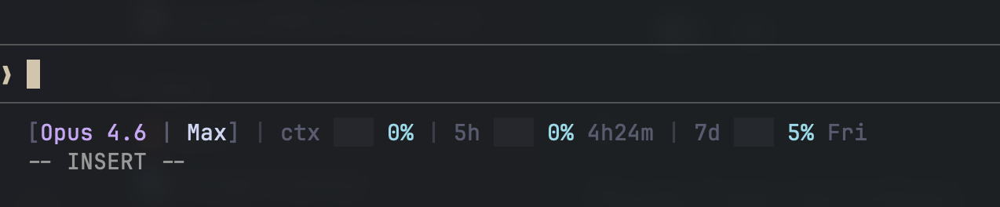
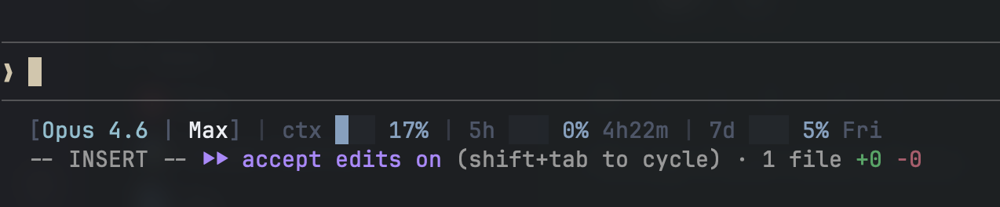
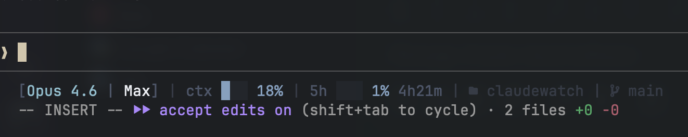

# claudewatch

A beautiful, themed status line for Claude Code with real-time usage tracking.







## Features

- **Real-time usage** — Shows actual 5-hour and 7-day limits from Claude's API (same data as the usage page)
- **Auto-detected plan** — Pro, Max, Team, or Enterprise from your credentials
- **Context window** — Live context usage with color-coded progress bar
- **10 themes** — Dracula, Tokyo Night, Catppuccin, Nord, and more
- **Extra usage** — Shows pay-as-you-go spend when enabled
- **Zero config** — Just install and go. Only setting is theme choice.

## Install

### With Go

```bash
go install github.com/nitintf/claudewatch@latest
claudewatch install
```

### Pre-built binary (macOS Apple Silicon)

```bash
curl -L https://github.com/nitintf/claudewatch/releases/latest/download/claudewatch-darwin-arm64 -o /usr/local/bin/claudewatch
chmod +x /usr/local/bin/claudewatch
claudewatch install
```

### As a Claude Code plugin

```bash
claude plugin add github.com/nitintf/claudewatch
```

Or via the marketplace:

```bash
/plugin marketplace add nitintf/claudewatch
/plugin install claudewatch@claudewatch
```

Then run `/claudewatch:setup` inside Claude Code to install the binary and configure your theme.

Restart Claude Code after installing.

## What it shows

| Segment | Example | Source |
|---------|---------|--------|
| Model + Plan | `[Opus 4.6 \| Max]` | Auto-detected from credentials |
| Context window | `ctx ███ 23%` | Claude Code status JSON |
| 5-hour limit | `5h █░░ 27% 1h03m` | Anthropic usage API |
| 7-day limit | `7d ░░░ 2% Fri` | Anthropic usage API |
| Extra usage | `$2/$100` | Anthropic usage API (when enabled) |
| Session cost | `cost $1.23` | Claude Code status JSON |
| Working dir | ` claudewatch` | Process cwd (off by default) |
| Git branch | ` main` | `git rev-parse` (off by default) |

Colors shift: blue < 50%, orange 50-80%, red > 80%.

## Config

`~/.config/claudewatch/config.toml`

```toml
theme = "tokyo-night"

# Toggle segments (all true by default unless noted)
show_plan   = true    # Plan name in model bracket
show_5h     = true    # 5-hour usage quota
show_7d     = true    # 7-day usage quota
show_extra  = true    # Pay-as-you-go extra usage
show_cost   = true    # Session cost
show_cwd    = false   # Working directory name
show_branch = false   # Git branch
```

Model name and context window are always shown. Plan and usage limits are auto-detected.

## Themes

10 built-in: `dracula` (default), `catppuccin-mocha`, `catppuccin-latte`, `nord`, `tokyo-night`, `gruvbox`, `solarized-dark`, `solarized-light`, `one-dark`, `rosepine`.

Custom themes go in `~/.config/claudewatch/themes/*.toml`.

## Plugin commands

| Command | Description |
|---------|-------------|
| `/claudewatch:setup` | Install binary and configure theme |
| `/claudewatch:config` | Change theme and toggle segments |
| `/claudewatch:update` | Update to latest version |
| `/claudewatch:uninstall` | Remove claudewatch (keeps config) |

## CLI commands

| Command | Description |
|---------|-------------|
| `claudewatch install` | Register with Claude Code + create config |
| `claudewatch uninstall` | Remove from Claude Code (keeps config) |
| `claudewatch update` | Fetch latest version and re-register |
| `claudewatch version` | Print installed version |
